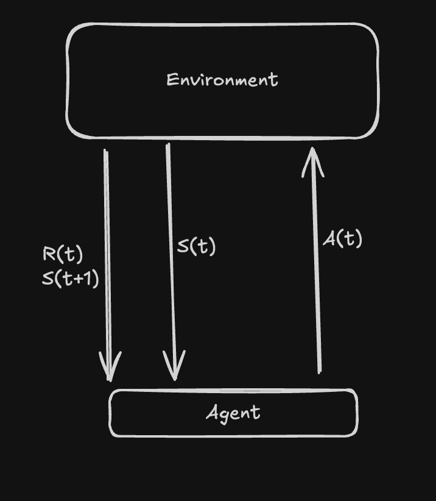

# Reinforcement Learning

## Elements common to all control tasks -->

- States , Actions , and Rewards at Time t
- Agents -- algorithms carrying out task in this case
- Environment -- not in control of agents (eg - gravity , opponents move)

## Markov Decision Process (MDP) -->

`Discrete Time Stochastic control Process`

- Extension of Markov chain with rewards and actions
- time moves forwards in finite intervals
- future states depend only partially on actions taken
- it is based on decision making to reach the target state

`(S.A.R.P.) -- Possible States , Set of Actions in each task , Set of Rewards for each (s,a) pair, PRobablities of passing from one state to another when taking each action`

_The next state depends only on the current state , not on previous states as they have no memory , if a process meets this property , ther are called Markov Process_

### Types

- 1
  - Finite -- all sets are finite (eg - Route mapping)
  - Infinite -- atleast one of the state is infinite (eg - driving a car)
- 2
  - Episodic
  - Continuing

#### Trajectory vs Episode

- Trajectory is the sequence of Elements that are generated when the agent moves from one state to another , Tao = S0,A0,R1,S1,A1,R2,S2,A2,R3,S3..
- Episodic is the Trajectory from initial state to terminal state..

#### Reward vs Return

- The goals of the task are represented by Rewards -- R(t)
  - Aim is to Maximise the long-term sum of Rewards
  - short term rewards can worsen long term rewards (eg - chess moves)
- `Rewards` is the immediate result that our action produces.
- `Return` is the sum of rewards from a certain time (t) till the task is completed (T)
